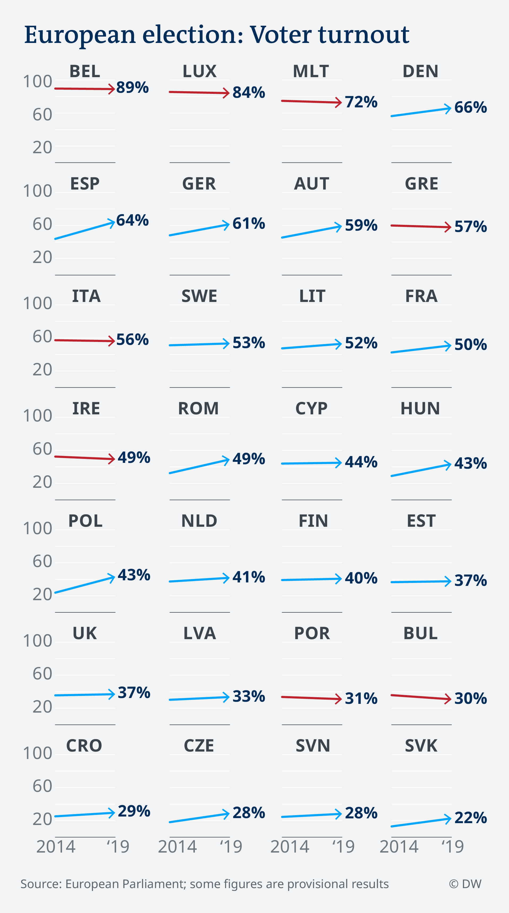

# How does voter turnout in different EU member states compare between the parliament election 2019 and 2014?

Data analysis: Gianna-Carina Grün

This European parliament election saw the highest voter turnout in history of the EU - almost [51 percent](https://election-results.eu).

However, voter turnout in some countries fell, compared to the previous European parliament election in 2014, and in some countries less than a quarter of voters cast their ballot.

